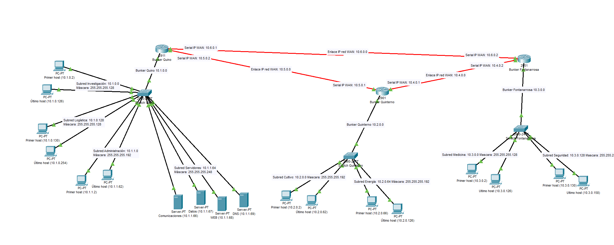

# Simulación de Red con Cisco Packet Tracer

Este trabajo fue realizado para la materia Sistemas Operativos y Redes I (UNGS). El proyecto implementa una red de comunicación entre tres búnkeres (Quino, Quinterno y Fontanarrosa) utilizando Cisco Packet Tracer.  El objetivo fue integrar conceptos de enrutamiento dinámico, VLANs y VPNs seguras, asegurando la segmentación del tráfico interno y la comunicación protegida entre los búnkeres.  

---

## Características principales

- **Enrutamiento dinámico:** Configuración de RIPv2 en todos los routers para el intercambio de rutas.  
- **VLANs:** Segmentación de la red interna en subredes lógicas para gestionar tráfico y seguridad.  
- **Troncales:** Configuración de enlaces troncales entre switch y router para transporte de múltiples VLANs.  
- **Subinterfaces en router:** Cada VLAN asociada a una subinterfaz con su dirección IP correspondiente.
- **VPNs (IPsec):** Creación de túneles seguros entre los tres búnkeres utilizando IPsec e ISAKMP para autenticación, cifrado y protección de datos.  

---

## Tecnologías y herramientas

- **Direccionamiento IP:** VLSM
- **Protocolos:** RIPv2, VLANs, IPsec, ISAKMP 

---

